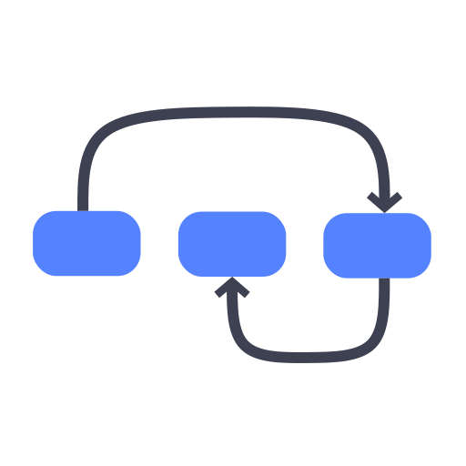

[](https://github.com/pyconll/pyconll)
[](https://coveralls.io/github/pyconll/pyconll?branch=master)
[](https://pyconll.readthedocs.io/en/stable)
[](https://github.com/pyconll/pyconll/releases)
[](https://gitter.im/pyconll/pyconll?utm_source=badge&utm_medium=badge&utm_campaign=pr-badge&utm_content=badge)

## pyconll

*Easily work with **CoNLL** files using the familiar syntax of **python**.*



##### Links
- [Homepage](https://pyconll.github.io)
- [Documentation](https://pyconll.readthedocs.io/)


### Installation

As with most python packages, simply use `pip` to install from PyPi.

```
pip install pyconll
```

`pyconll` is also available as a conda package on the `pyconll` channel. Only packages 2.2.0 and newer are available on conda at the moment.

```
conda install -c pyconll pyconll
```

pyconll supports Python 3.6 and greater, starting in version 3.0.0. In general pyconll will focus development efforts on officially supported python versions. Python 3.5 reached end of support in October 2020.


### Use

This tool is intended to be a **minimal**, **low level**, **expressive** and **pragmatic** library in a widely used programming language. pyconll creates a thin API on top of raw CoNLL annotations that is simple and intuitive.

It offers the following features:
* Regular CI testing and validation against all UD v2.x versions.
* A strong domain model that includes CoNLL sources, Sentences, Tokens, Trees, etc.
* A typed API for better development experience and better semantics.
* A focus on usability and simplicity in design (no dependencies)
* Performance optimizations for a smooth development workflow no matter the dataset size (performs about 25%-35% faster than other comparable packages)

See the following code example to understand the basics of the API.

```python
# This snippet finds sentences where a token marked with part of speech 'AUX' are
# governed by a NOUN. For example, in French this is a less common construction
# and we may want to validate these examples because we have previously found some
# problematic examples of this construction.
import pyconll

train = pyconll.load_from_file('./ud/train.conllu')

review_sentences = []

# Conll objects are iterable over their sentences, and sentences are iterable
# over their tokens. Sentences also de/serialize comment information.
for sentence in train:
    for token in sentence:

        # Tokens have attributes such as upos, head, id, deprel, etc, and sentences
        # can be indexed by a token's id. We must check that the token is not the
        # root token, whose id, '0', cannot be looked up.
        if token.upos == 'AUX' and (token.head != '0' and sentence[token.head].upos == 'NOUN'):
            review_sentences.append(sentence)

print('Review the following sentences:')
for sent in review_sentences:
    print(sent.id)
```

A full definition of the API can be found in the [documentation](https://pyconll.readthedocs.io/) or use the [quick start](https://pyconll.readthedocs.io/en/stable/starting.html) guide for a focused introduction.


### Uses and Limitations

This package edits CoNLL-U annotations. This does not include the annotated text itself. Word forms on Tokens are not editable and Sentence Tokens cannot be reassigned or reordered. `pyconll` focuses on editing CoNLL-U annotation rather than creating it or changing the underlying text that is annotated. If there is interest in this functionality area, please create a GitHub issue for more visibility.

This package also is only validated against the CoNLL-U format. The CoNLL and CoNLL-X format are not supported, but are very similar. I originally intended to support these formats as well, but their format is not as well defined as CoNLL-U so they are not included. Please create an issue for visibility if this feature interests you.

Lastly, linguistic data can often be very large and this package attempts to keep that in mind. pyconll provides methods for creating in memory conll objects along with an iterate only version in case a corpus is too large to store in memory (the size of the memory structure is several times larger than the actual corpus file). The iterate only version can parse upwards of 100,000 words per second on a 16gb ram machine, so for most datasets to be used on a local dev machine, this package will perform well. The 2.2.0 release also improves parse time and memory footprint by about 25%!


### Contributing

Contributions to this project are welcome and encouraged! If you are unsure how to contribute, here is a [guide](https://help.github.com/en/articles/creating-a-pull-request-from-a-fork) from Github explaining the basic workflow. After cloning this repo, please run `pip install -r requirements.txt` to properly setup locally. Some of these tools like yapf, pylint, and mypy do not have to be run locally, but CI builds will fail without their successful running. Some other release dependencies like twine and sphinx are also installed.

For packaging new versions, use setuptools version 24.2.0 or greater for creating the appropriate packaging that recognizes the `python_requires` metadata. Final packaging and release is now done with Github actions so this is less of a concern.


#### README and CHANGELOG

When changing either of these files, please change the Markdown version and run ``make gendocs`` so that the other versions stay in sync.

#### Release Checklist

Below enumerates the general release process explicitly. This section is for internal use and most people do not have to worry about this. First note, that the dev branch is always a direct extension of master with the latest changes since the last release. That is, it is essentially a staging release branch.

* Change the version in `pyconll/_version.py` appropriately.
* Merge dev into master **locally**. Github does not offer a fast forward merge and explicitly uses --no-ff. So to keep the linear nature of changes, merge locally to fast forward. This is assuming that the dev branch looks good on CI tests which do not automatically run in this situation.
* Push the master branch. This should start some CI tests specifically for master. After validating these results, create a tag corresponding to the next version number and push the tag.
* Create a new release from this tag from the [Releases page](https://github.com/pyconll/pyconll/releases). On creating this release, two workflows will start. One releases to pypi, and the other releases to conda.
* Validate these workflows pass, and the package is properly released on both platforms.
